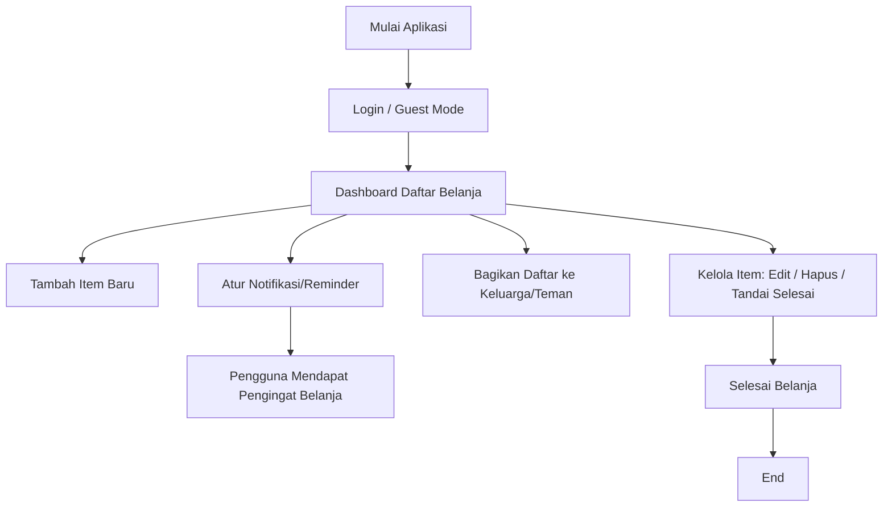

# Project Requirement Document (PRD)

*Aplikasi Belanja Pintar*

---

## 1. Pendahuluan / Executive Summary

Aplikasi **Belanja Pintar** adalah aplikasi daftar belanja digital yang memudahkan pengguna dalam mencatat, mengatur, dan berbagi daftar belanja mereka. Aplikasi ini terinspirasi dari aplikasi populer seperti **Listonic** yang telah diunduh jutaan kali.

Tujuan utama aplikasi ini adalah menghadirkan solusi **praktis, efisien, dan kolaboratif** untuk mengelola kebutuhan belanja harian, baik secara individu maupun bersama keluarga/teman.

---

## 2. Visi & Tujuan Aplikasi

* **Visi:** Menjadi aplikasi daftar belanja pintar yang sederhana, cepat, dan dapat digunakan oleh semua kalangan.
* **Tujuan:**

  * Membantu pengguna mengelola daftar belanja dengan lebih rapi.
  * Mengurangi risiko lupa membeli barang penting.
  * Mendukung kolaborasi dalam belanja (misalnya antar anggota keluarga).
  * Menjadi portofolio nyata bagi pengembang yang bisa dipublikasikan ke Play Store.

---

## 3. Permasalahan yang Dipecahkan

* **Manual dan tidak efisien:** Banyak orang masih menggunakan catatan kertas atau aplikasi catatan umum yang kurang optimal.
* **Sering lupa:** Pengguna sering melupakan barang penting karena daftar belanja tidak terorganisir.
* **Kolaborasi terbatas:** Sulit berbagi daftar belanja antar anggota keluarga atau teman.

Aplikasi **Belanja Pintar** hadir untuk memecahkan permasalahan tersebut melalui fitur daftar belanja terstruktur, notifikasi, dan berbagi daftar.

---

## 4. Audiens Target

* **Demografi:**

  * Mahasiswa, pekerja, ibu rumah tangga, pasangan muda.
  * Usia 18–40 tahun.
  * Domisili di perkotaan dan pinggiran kota.
* **Perilaku:**

  * Sering belanja kebutuhan harian atau mingguan.
  * Menggunakan smartphone Android/iOS.
  * Membutuhkan aplikasi sederhana, gratis, dan cepat.
* **Kebutuhan:**

  * Daftar belanja yang mudah diakses.
  * Fitur pengingat agar tidak lupa.
  * Kemudahan berbagi daftar belanja dengan orang lain.

---

## 5. Fitur-Fitur Utama (High-Level)

* **Manajemen Daftar Belanja:** Tambah, hapus, ubah item belanja.
* **Kategori Barang:** Mengelompokkan item berdasarkan kategori (makanan, kebersihan, elektronik, dll).
* **Notifikasi & Reminder:** Mengingatkan jadwal belanja atau item penting.
* **Berbagi Daftar:** Kolaborasi daftar belanja dengan keluarga/teman.
* **Tandai Barang:** Centang barang yang sudah dibeli.
* **Pencarian Cepat:** Mencari item dengan mudah.

---

## 6. Alur Pengguna (User Flow - High-Level)

---

## 7. Persyaratan Non-Fungsional (High-Level)

* **Kinerja:**

  * Aplikasi harus dapat berjalan lancar di Android minimal versi 8.0.
  * Waktu respon < 2 detik untuk operasi dasar.
* **Keamanan:**

  * Data pengguna disimpan aman secara lokal/cloud dengan enkripsi dasar.
* **Usability:**

  * UI sederhana, mudah digunakan oleh semua kalangan, termasuk non-teknis.
* **Skalabilitas:**

  * Aplikasi dapat ditingkatkan ke model cloud untuk sinkronisasi multi-device.
* **Portabilitas:**

  * Dibangun dengan Flutter agar bisa digunakan di Android dan iOS.

---

## 8. Batasan (Constraints)

* **Waktu:** Target MVP (minimum viable product) dalam 3 bulan.
* **Anggaran:** Terbatas pada sumber daya mahasiswa/individu.
* **Teknologi:** Flutter (frontend), Firebase / SQLite (database), Google Cloud Messaging (notifikasi).
* **Tim:** 1–3 orang (pengembang, desainer, tester).

---

## 9. Nilai Bisnis (Business Value)

* **Bagi Pengguna:**

  * Lebih efisien, praktis, dan kolaboratif dibanding catatan manual.
* **Bagi Pengembang:**

  * Portofolio nyata yang bisa dipublikasikan di Play Store.
* **Potensi Komersial:**

  * Monetisasi lewat iklan ringan atau fitur premium (tanpa iklan, tema khusus, sinkronisasi cloud).

---

## 10. Penutup

PRD ini menjadi acuan awal pengembangan **Belanja Pintar**. Dokumen ini mendefinisikan visi, audiens, fitur, batasan, dan nilai aplikasi sehingga semua pihak yang terlibat memiliki pemahaman yang sama mengenai tujuan proyek.

Langkah berikutnya adalah menyusun **SRS (Software Requirement Specification)** untuk mendetailkan kebutuhan fungsional dan teknis aplikasi.
