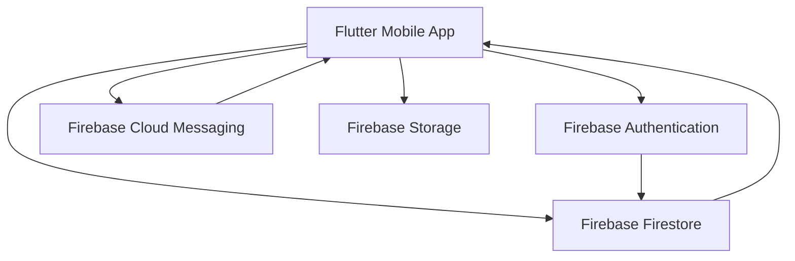
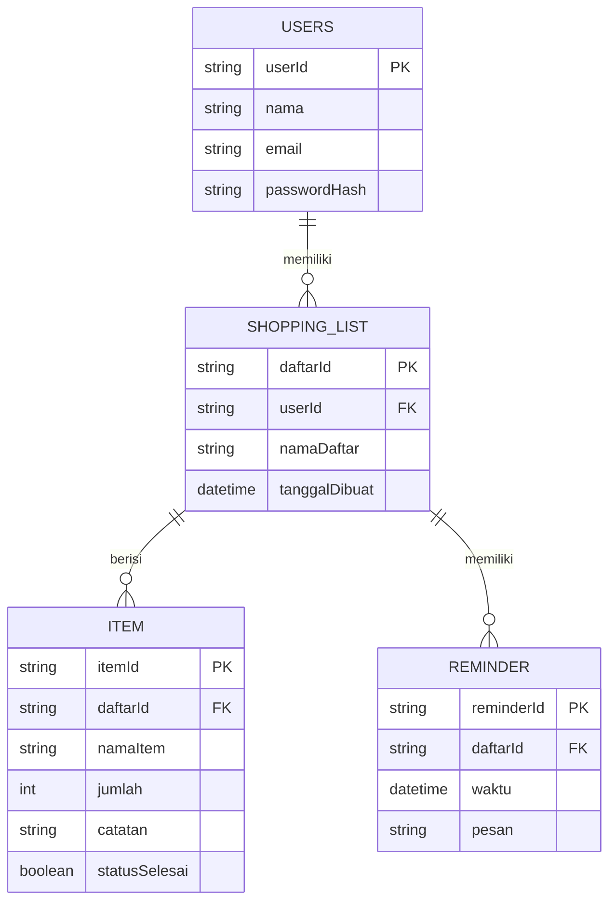
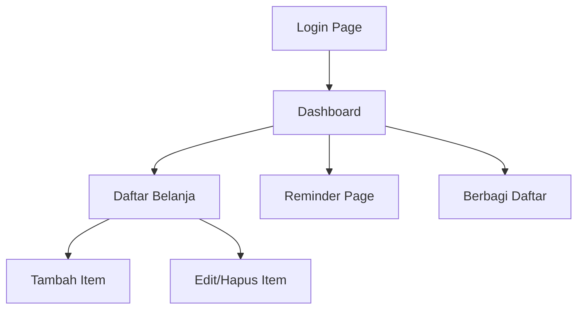

# Software Design Document (SDD)

**Aplikasi Belanja Pintar**

---

## 1. Pendahuluan

### 1.1 Tujuan

Dokumen ini menjelaskan desain teknis dari **Aplikasi Belanja Pintar**, termasuk arsitektur sistem, desain database, rancangan antarmuka pengguna, serta spesifikasi modul utama.

### 1.2 Ruang Lingkup

SDD ini mencakup:

* Arsitektur sistem (frontend & backend).
* Desain database (ERD).
* Desain modul utama.
* Desain antarmuka pengguna (UI/UX).
* Spesifikasi teknis integrasi Firebase.

---

## 2. Arsitektur Sistem

Aplikasi dibangun dengan **Flutter** (frontend) dan **Firebase** (backend).

* **Firebase Authentication**: login & registrasi pengguna.
* **Firebase Firestore**: penyimpanan daftar belanja & item.
* **Firebase Cloud Messaging**: pengingat (notifikasi).
* **Firebase Storage**: (opsional) penyimpanan gambar catatan belanja.

---

## 3. Desain Database (ERD)

---

## 4. Desain Modul

### 4.1 Modul Autentikasi

* **Input**: email, password.
* **Proses**: verifikasi dengan Firebase Authentication.
* **Output**: akses ke dashboard atau error message.

### 4.2 Modul Daftar Belanja

* **Fungsi**: membuat daftar, menampilkan daftar, menghapus daftar.
* **Integrasi**: Firestore → koleksi `shopping_lists`.

### 4.3 Modul Item Belanja

* **Fungsi**: tambah item, edit item, tandai selesai, hapus item.
* **Integrasi**: Firestore → koleksi `items`.

### 4.4 Modul Reminder

* **Fungsi**: atur reminder, simpan waktu ke Firestore, trigger notifikasi via Cloud Messaging.

### 4.5 Modul Berbagi Daftar

* **Fungsi**: bagikan daftar ke pengguna lain dengan ID/email.
* **Integrasi**: menambahkan akses user lain pada field `sharedWith` di `shopping_lists`.

---

## 5. Desain Antarmuka Pengguna

### 5.1 Halaman Login

* Form email & password.
* Tombol login & registrasi.

### 5.2 Dashboard

* List daftar belanja (card view).
* Tombol tambah daftar.

### 5.3 Halaman Daftar Belanja

* Menampilkan item dalam checklist.
* Tombol tambah item.
* Aksi swipe untuk edit/hapus.

### 5.4 Halaman Reminder

* Form pilih waktu & pesan.
* Tombol simpan reminder.

### 5.5 Wireframe Sederhana

---

## 6. Spesifikasi Teknis

* **Framework**: Flutter (Dart).
* **Database**: Firebase Firestore (NoSQL).
* **Authentication**: Firebase Auth (Email/Password).
* **Notification**: Firebase Cloud Messaging.
* **Storage**: Firebase Storage (opsional).

---

## 7. Keamanan

* Semua data hanya dapat diakses oleh user yang login.
* Firestore Rules:

  * User hanya bisa mengakses data dengan `userId` miliknya.
  * Shared list: user lain hanya bisa akses jika `userId` ada dalam `sharedWith`.
* Password disimpan dalam bentuk hash di Firebase Auth, bukan plaintext.

---

## 8. Kriteria Keberhasilan

* Semua modul (login, daftar belanja, item, reminder, berbagi) berjalan sesuai kebutuhan.
* UI responsif di Android (smartphone & tablet).
* Sistem dapat mengirim notifikasi tepat waktu.
* Aplikasi tidak crash pada penggunaan normal.

---

## 9. Referensi

* IEEE Std 1016-2009: *IEEE Standard for Information Technology—Systems Design*.
* Dokumentasi Firebase: [https://firebase.google.com/docs](https://firebase.google.com/docs)
