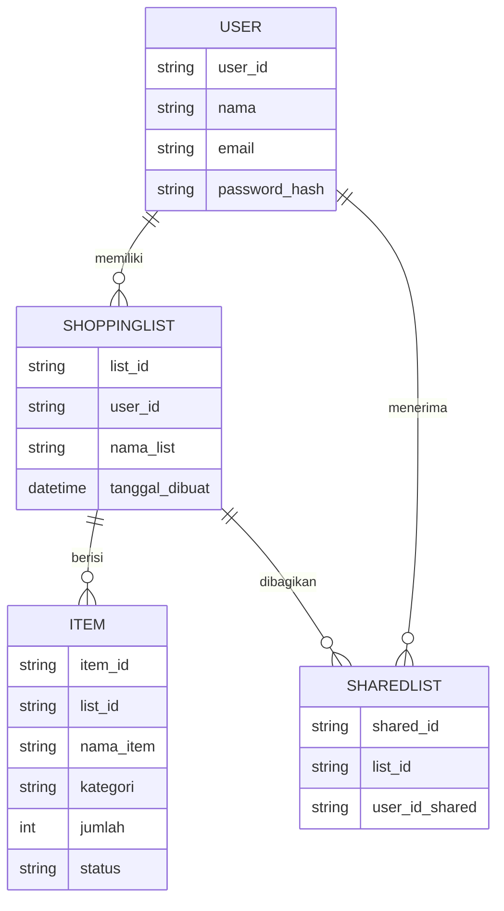

# Software Requirements Specification (SRS)

*Aplikasi Belanja Pintar*

---

## 1. Pendahuluan

### 1.1 Tujuan

Dokumen ini mendefinisikan kebutuhan perangkat lunak aplikasi **Belanja Pintar** secara detail. Dokumen ini berfungsi sebagai kontrak antara pengembang dan pemangku kepentingan mengenai fitur, fungsi, dan kualitas aplikasi yang harus dipenuhi.

### 1.2 Ruang Lingkup

Aplikasi **Belanja Pintar** adalah aplikasi mobile berbasis Flutter yang memungkinkan pengguna:

* Membuat daftar belanja digital.
* Menambahkan item dengan kategori, jumlah, dan catatan.
* Menandai item yang sudah dibeli.
* Berbagi daftar dengan orang lain.
* Menerima notifikasi pengingat belanja.

Aplikasi ini akan dikembangkan dengan target awal platform **Android**, kemudian dapat diperluas ke **iOS**.

### 1.3 Definisi & Singkatan

* **FR (Functional Requirement):** Persyaratan fungsional.
* **NFR (Non-Functional Requirement):** Persyaratan non-fungsional.
* **Actor:** Pihak yang berinteraksi dengan sistem (Pengguna, Admin, Sistem).

### 1.4 Referensi

* PRD Aplikasi Belanja Pintar.
* Dokumentasi Flutter SDK.
* Dokumentasi Firebase Authentication, Firestore, dan Cloud Messaging.

---

## 2. Persyaratan Fungsional

### 2.1 Daftar Persyaratan Fungsional

| ID    | Nama Fitur               | Deskripsi                                                      | Aktor    | Input                         | Output                     | Pre-Kondisi                 | Post-Kondisi                    |
| ----- | ------------------------ | -------------------------------------------------------------- | -------- | ----------------------------- | -------------------------- | --------------------------- | ------------------------------- |
| FR001 | Login & Registrasi       | Pengguna dapat membuat akun baru atau login.                   | Pengguna | Email, password               | Dashboard atau pesan error | Aplikasi terhubung internet | Pengguna masuk aplikasi         |
| FR002 | Manajemen Daftar Belanja | Tambah, edit, hapus daftar belanja.                            | Pengguna | Nama daftar, item             | Daftar tersimpan           | Sudah login                 | Daftar tersimpan di database    |
| FR003 | Tambah Item Belanja      | Pengguna menambahkan item baru ke daftar.                      | Pengguna | Nama item, kategori, jumlah   | Item tersimpan             | Ada daftar aktif            | Item muncul di daftar belanja   |
| FR004 | Tandai Barang Selesai    | Pengguna menandai barang sudah dibeli.                         | Pengguna | Checkbox/tombol centang       | Status item berubah        | Ada daftar aktif            | Item ditandai sebagai “dibeli”  |
| FR005 | Notifikasi / Reminder    | Pengguna mengatur pengingat belanja.                           | Pengguna | Tanggal, jam                  | Push notifikasi            | Izin notifikasi aktif       | Pengguna menerima notifikasi    |
| FR006 | Berbagi Daftar Belanja   | Pengguna berbagi daftar ke orang lain melalui email atau link. | Pengguna | Email penerima / link sharing | Undangan berbagi           | Daftar belanja ada          | Penerima dapat mengakses daftar |

---

### 2.2 Use Case Diagram

```mermaid
usecaseDiagram
  actor Pengguna
  actor Firebase as "Sistem Firebase"

  Pengguna --> (Login/Registrasi)
  Pengguna --> (Kelola Daftar Belanja)
  Pengguna --> (Tambah Item)
  Pengguna --> (Tandai Item Selesai)
  Pengguna --> (Atur Reminder)
  Pengguna --> (Berbagi Daftar)

  (Login/Registrasi) --> (Sistem Firebase)
  (Kelola Daftar Belanja) --> (Sistem Firebase)
  (Tambah Item) --> (Sistem Firebase)
  (Berbagi Daftar) --> (Sistem Firebase)
  (Atur Reminder) --> (Sistem Firebase)

```

---

## 3. Persyaratan Non-Fungsional

| ID     | Kategori        | Deskripsi                                                                   |
| ------ | --------------- | --------------------------------------------------------------------------- |
| NFR001 | Kinerja         | Respon aplikasi < 2 detik untuk operasi dasar.                              |
| NFR002 | Keamanan        | Password di-hash, data pengguna dienkripsi.                                 |
| NFR003 | Keandalan       | Uptime sistem minimal 99%.                                                  |
| NFR004 | Usability       | UI sederhana, mudah digunakan semua kalangan.                               |
| NFR005 | Skalabilitas    | Sistem dapat diperluas ke cloud untuk sinkronisasi multi-device.            |
| NFR006 | Portabilitas    | Dibangun dengan Flutter agar dapat berjalan di Android & iOS.               |
| NFR007 | Maintainability | Kode modular menggunakan arsitektur MVVM atau BLoC untuk memudahkan update. |

---

## 4. Antarmuka Eksternal

* **Firebase Authentication:** Login & registrasi.
* **Firebase Firestore / SQLite:** Penyimpanan daftar belanja.
* **Firebase Cloud Messaging:** Push notifikasi.
* **Google Sign-In (opsional):** Autentikasi alternatif.

---

## 5. Model Data (High-Level)



---

## 6. Batasan & Asumsi

* **Platform:** Versi awal hanya mendukung Android.
* **Internet:** Beberapa fitur (login, berbagi, sinkronisasi) membutuhkan koneksi internet.
* **Fitur Premium:** Tema custom dan sinkronisasi cloud akan tersedia pada versi lanjutan.

---

## 7. Penutup

Dokumen **SRS Belanja Pintar** ini menjelaskan kebutuhan teknis aplikasi yang akan dikembangkan. Dengan dokumen ini, tim pengembang dan tester memiliki acuan jelas dalam membangun, menguji, dan memvalidasi aplikasi agar sesuai dengan tujuan bisnis dan kebutuhan pengguna.

Langkah berikutnya adalah menyusun **SDD (Software Design Document)** untuk merancang arsitektur teknis dan detail implementasi aplikasi.
