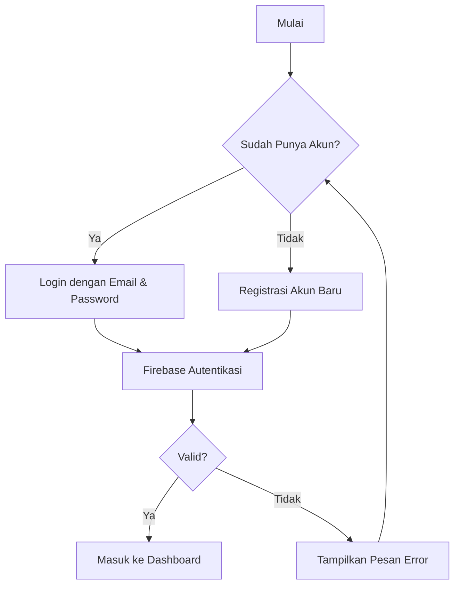
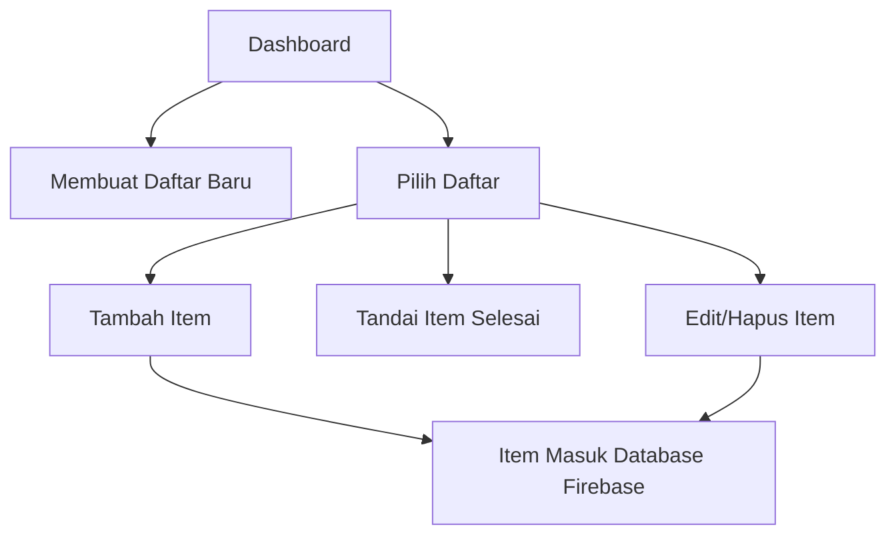
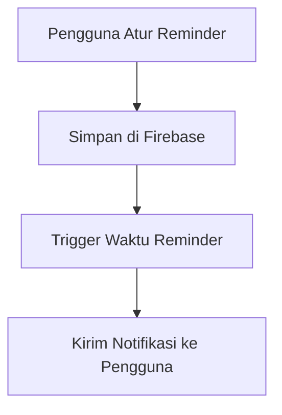
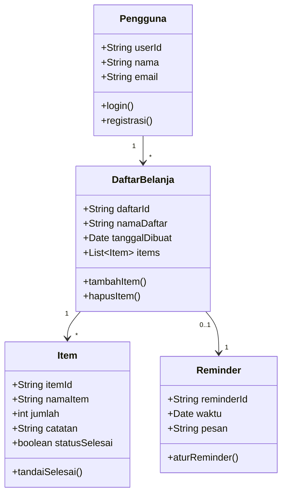

# Software Requirements Specification (SRS)

**Aplikasi Belanja Pintar**

---

## 1. Pendahuluan

### 1.1 Tujuan

Dokumen ini menyajikan spesifikasi kebutuhan perangkat lunak untuk **Aplikasi Belanja Pintar**, aplikasi mobile yang membantu pengguna mencatat, mengelola, dan berbagi daftar belanja sehari-hari dengan lebih efisien.

### 1.2 Ruang Lingkup

Aplikasi Belanja Pintar ditujukan untuk:

* Membuat dan mengelola daftar belanja.
* Menambahkan item belanja dengan detail (nama, jumlah, kategori, catatan).
* Menandai item yang sudah dibeli.
* Memberikan pengingat (reminder) sebelum belanja.
* Mendukung berbagi daftar ke pengguna lain.

Aplikasi ini berbasis **Flutter** dengan backend **Firebase** (Authentication, Firestore, dan Push Notification).

### 1.3 Definisi, Singkatan, dan Akronim

* **SRS**: Software Requirements Specification.
* **CRUD**: Create, Read, Update, Delete.
* **Firebase**: Backend as a Service (BaaS) dari Google.

---

## 2. Deskripsi Umum

### 2.1 Perspektif Produk

Aplikasi berperan sebagai alat produktivitas, mirip dengan aplikasi *Listonic* atau *Google Keep*, namun fokus pada **pengelolaan belanja harian**.

### 2.2 Fungsi Utama

* Registrasi/Login.
* Membuat & mengelola daftar belanja.
* Menambahkan item belanja.
* Menandai item selesai.
* Reminder otomatis.
* Berbagi daftar ke pengguna lain.

### 2.3 Karakteristik Pengguna

* **Pengguna Umum**: individu atau keluarga yang membutuhkan catatan belanja.
* **Power User**: pengguna aktif yang ingin berbagi daftar ke keluarga/teman.

### 2.4 Batasan

* Memerlukan koneksi internet.
* Akun pengguna wajib login.
* Hanya mendukung bahasa Indonesia (versi awal).

---

## 3. Kebutuhan Fungsional

### 3.1 Autentikasi

* **F1.1**: Pengguna dapat registrasi menggunakan email & password.
* **F1.2**: Pengguna dapat login.
* **F1.3**: Sistem memverifikasi akun dengan Firebase.

### 3.2 Daftar Belanja

* **F2.1**: Pengguna dapat membuat daftar belanja baru.
* **F2.2**: Pengguna dapat menambahkan item (nama, jumlah, catatan).
* **F2.3**: Pengguna dapat menandai item selesai.
* **F2.4**: Pengguna dapat menghapus atau mengedit item.

### 3.3 Reminder

* **F3.1**: Pengguna dapat menambahkan pengingat.
* **F3.2**: Sistem mengirim notifikasi sebelum waktu belanja.

### 3.4 Berbagi Daftar

* **F4.1**: Pengguna dapat membagikan daftar ke akun lain.
* **F4.2**: Penerima dapat melihat & mengedit (jika diberi izin).

---

## 4. Kebutuhan Non-Fungsional

* **N1**: Aplikasi harus berjalan pada Android minimal versi 8.0.
* **N2**: Respon aplikasi < 2 detik.
* **N3**: Data pengguna disimpan di Firebase dengan keamanan Firestore Rules.
* **N4**: Antarmuka ramah pengguna (UX sederhana).

---

## 5. Diagram Alur Sistem

### 5.1 Flowchart Login & Registrasi

---

### 5.2 Flowchart Pengelolaan Daftar Belanja

---

### 5.3 Flowchart Reminder

---

## 6. Diagram Kelas (Class Diagram)

---

## 7. Antarmuka Pengguna (Wireframe Sederhana)

* **Halaman Login/Registrasi**: form email & password.
* **Dashboard**: daftar belanja tampil sebagai list card.
* **Halaman Daftar Belanja**: menampilkan item, tombol tambah item, tombol checklist.
* **Reminder**: form pilih tanggal/waktu + pesan.

---

## 8. Kriteria Keberhasilan

* Aplikasi dapat login/registrasi melalui Firebase.
* Pengguna dapat menambah/menghapus item di daftar belanja.
* Reminder berhasil mengirim notifikasi.
* Daftar dapat dibagikan ke pengguna lain.

---

## 9. Referensi

* Sommerville, Ian. *Software Engineering*. Pearson.
* IEEE Std 830-1998: *IEEE Recommended Practice for Software Requirements Specifications*.
* Dokumentasi Firebase: [https://firebase.google.com/docs](https://firebase.google.com/docs)
